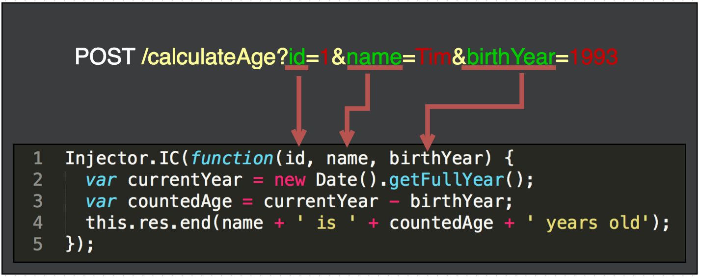

# Express.js Params Injector

How often your express.js route or controller function starts out like this?

    app.get('/calculateAge', function(req, res, next) {
      var id = req.query['id'];
      var name = req.body['name'];
      var birthYear = req.body['birthYear'];
       
      // do what ever ...
      res.end();
    });

Request:

    POST /calculateAge?id=1
    
    {
        "name": "Tim",
        "birthYear": 1993
    }

In my experience that happens all the time. Now, wouldn't it be nice if you can write parameters you want as a function arguments instead of req, res objects and then start extracting them. If any request is changed, remembering to change you route function to represent new arguments.
That is what I thought to my self and wrote this micro lib. I was inspired by AngularJS dependency injection approach and used same concepts here. With this lib route function can look like this:

    app.get('/calculateAge', Injector.IC(function(id, name, birthYear) {
        // do what ever ...
        this.res.end();
    }));
    
See Usage section for more examples.

# Installation

In console:

    npm install express-param-injector
  
In code:

    require('express-param-injector');
  
  
# Usage

Start your express application, require express-param-injector and wrap your route function in Injector.IC method.
Then you can write any parameters names that you want to be injected as function arguments and Injector will look for them and inject them in to the function.

    var app = require('express')();
    var Injector = require('express-param-injector');
  
    app.listen(1334);
  
    app.get('/calculateAge', Injector.IC(function(name, birthYear, res) {
      var currentYear = new Date().getFullYear();
      var countedAge = currentYear - birthYear;
      res.end(name + ' is ' + countedAge + ' years old');
    }));
  
Closer look:

    Injector.IC(function(firstParam, req, res, anotherParam, next, lastParam) {
      // firstParam, anotherParam, lastParam - parameter in query, params or body (bodyParser), param injection
      // req - express.js request object, smart injection
      // res - express.js response object, smart injection
      // name - parameter in query, params or body (bodyParser), param injection
      // next - express.js callback function for middleware, smart injection
    
      // and order does not matter!
    });

This can be applied to any callback express function that expects req, res to be first two params, and next callback will work as well:

    app.use(Injector.IC(function(id, next) {
      // check id here
      next();
    }));

`Request`, `response` and `next` alternatively can be accessed through `this` inside route function:

    app.post('/add', Injector.IC(function(a, b) {
      var result = a + b;
      this.res.end(result);  
    }));
 
 In case you have to have a specific `this` inside your route you can pass a scope function as a last parameter to Injector.IC:
 
       /** @constructor */
       function Constructor() {}
   
       Constructor.prototype.checkId = function(id) {
         return id.toString() === (1234).toString();
       };
   
   
       var myConstructor = new Constructor();
       
       app.get('/checkId', Injector.IC(function(id, res, self) {
          // this is now `myConstructor`
          // but self.req and self.res are now avalible 
          
         if (this.checkId(id)) {
           res.status(200);
         } else {
           res.status(400);
         }
         res.end();
       }, myConstructor)));
       
If there is a need to still refer to Injector `self` (or `injector`) param key can be used:

       app.get('/checkId', Injector.IC(function(id, self, injector) {
          // this = myConstructor
          // self, injector both refer injector scope
          injector.res.end('ID is ' + id);
       }, myConstructor));
 
 Client can pass parameters in URL string or body with express.js body parser, parameters will be found and injected in following order:
 
 1. request.query;
 2. request.params;
 3. request.body; // if exists
 
### Have a nice day :)

 
 
 